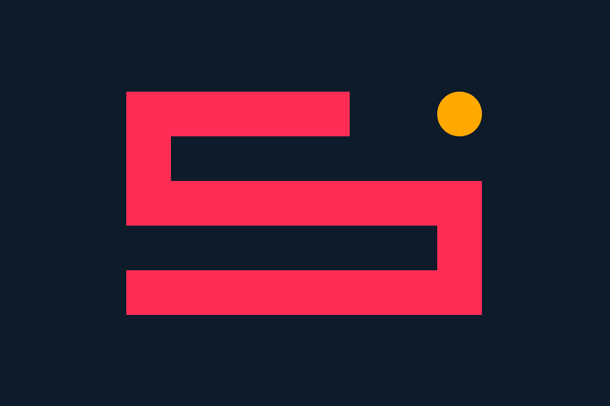

# 🐍 Snake Game – Neon Edition

> A sleek and responsive Snake game using HTML5 Canvas, perfect for modern browsers and mobile devices.

A modern and smooth version of the classic Snake game with a neon aesthetic, built using HTML5 Canvas, JavaScript, and CSS.  
Optimized for both desktop and mobile — with keyboard and touch controls included.

🎮 [Play the game on GitHub Pages](https://parsazfi.github.io/snake-game/)  
📂 [View the source on GitHub](https://github.com/parsazfi/snake-game)



---

## 🔥 Features

- 🔄 Framerate-independent smooth motion (`deltaTime`)
- 🖥️ Canvas-based responsive design
- 📱 Touch controls for mobile
- 🌙 Dark-mode neon visuals
- 🚫 Prevents scroll on mobile during play
- ✅ Game over and win states with transitions

---

## 📦 How to Run Locally

```bash
git clone https://github.com/parsazfi/snake-game.git
cd snake-game
